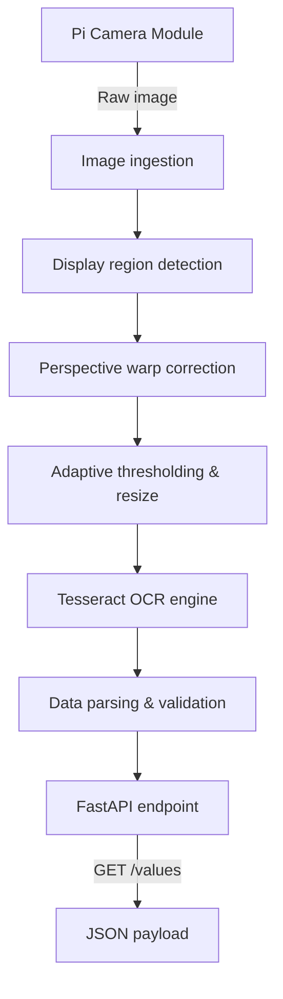

# PiReadsEndpoint — Edge OCR Gateway for Legacy Equipment

[](https://www.raspberrypi.com/)
[](https://www.python.org/)
[](https://opencv.org/)
[]()
[](https://fastapi.tiangolo.com/)
[]()

---

## What it does

Many industrial instruments — multimeters, pressure gauges, environmental sensors — display readings on a physical screen but have no digital output or network interface. Getting their data into a modern IoT pipeline normally requires manual logging.

**PiReadsEndpoint** solves this by pointing a Pi Camera at the instrument's display and running a Computer Vision + OCR pipeline entirely on the edge device, then exposing the extracted value as a structured JSON REST endpoint.

No cloud dependency. No internet required. Runs fully offline on a Raspberry Pi.

```
Physical display (any instrument)
        │
   Pi Camera capture
        │
   OpenCV preprocessing       ← perspective correction, thresholding
        │
   Tesseract OCR               ← digit extraction
        │
   FastAPI endpoint            ← GET /values → JSON
        │
   Any client / IoT platform
```

---

## Key features

- **Edge-only inference:** OpenCV and Tesseract run entirely on-device — no cloud API calls
- **Perspective correction:** automatically detects and straightens the display region for reliable OCR
- **Structured output:** raw visual data becomes a clean, timestamped JSON payload ready for ingestion by InfluxDB, ThingsBoard, or any HTTP client
- **ARM-optimised:** tuned for Raspberry Pi 4/5 (ARMv8/ARMv9) memory constraints

---

## Data pipeline



---

## Installation

### 1. System dependencies (Raspberry Pi OS / Debian)

```bash
sudo apt-get update && sudo apt-get upgrade -y
sudo apt-get install -y tesseract-ocr libtesseract-dev lsb-release
sudo apt-get install -y libgl1-mesa-glx libglib2.0-0
```

### 2. Python environment

```bash
git clone https://github.com/carnestoltes/PiReadsEndpoint.git
cd PiReadsEndpoint
python3 -m venv .venv
source .venv/bin/activate
pip3 install --upgrade pip
pip3 install -r requirements.txt
```

---

## Running

```bash
uvicorn src.main:app --host 0.0.0.0 --port 8000
```

Query from any machine on the network:

```bash
curl -X GET http://<RASPBERRY_PI_IP>:8000/values
```

### Example response

```json
{
  "status": "success",
  "timestamp": "2026-06-03T17:28:00Z",
  "device_id": "edge-pi-01",
  "telemetry": {
    "detected_value": 45.2,
    "confidence_score": 0.94
  }
}
```

---

## Topics

`iot` `raspberry-pi` `edge-computing` `computer-vision` `ocr` `opencv` `tesseract` `fastapi` `python` `industrial-iot` `data-acquisition` `legacy-equipment`
