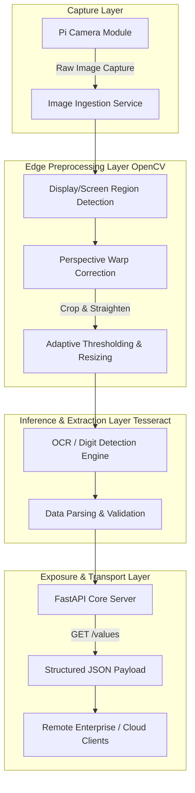

# Edge AI Gateway: Pi Reads Endpoint (OpenCV + OCR Data Pipeline)


An intelligent Edge Computing gateway designed for automated legacy equipment digitization. This repository deploys a lightweight **Computer Vision & OCR pipeline** on a Raspberry Pi to capture physical display data via a Pi Camera, process image transformations locally, and expose structured telemetry data through a high-performance **FastAPI REST endpoint**.

---

## Key Architectural Features

- **Edge AI / Machine Vision Integration:** Offloads image preprocessing (OpenCV) and optical character recognition (Tesseract OCR) completely to the edge device, removing cloud-processing dependencies.
- **Perspective & Geometric Correction:** Implements automated display region detection, cropping, straightening, and scaling to ensure deterministic OCR inputs.
- **Structured Data Serialization:** Transmutes raw visual information into standard, queryable JSON payloads ready for ingestion by upstream industrial networks or time-series databases.
- **Deterministic Resource Management:** Optimized specifically for ARMv8/ARMv9 architectures (Raspberry Pi 4/5) to balance memory allocation between OpenCV buffers and the ASGI web server thread.

---

## Data Pipeline Architecture



# Production Deployment & Dependencies

Operating Computer Vision libraries on ARM Linux requires installing native system dependencies alongside Python packages.

## 1. Host System OS Preparation

Install the native binary packages required by OpenCV and the Tesseract OCR engine on Raspberry Pi OS (Debian/Ubuntu):

```bash
sudo apt-get update && sudo apt-get upgrade -y

# Install native libraries for image processing and OCR
sudo apt-get install -y tesseract-ocr libtesseract-dev lsb-release
sudo apt-get install -y libgl1-mesa-glx libglib2.0-0
```

## 2. Environment Isolation & Pipeline Setup

Initialize a secure Python virtual environment and pull the asynchronous framework modules:

```bash
# Clone the repository
git clone https://github.com/carnestoltes/pi-reads-endpoint.git
cd pi-reads-endpoint

# Set up virtual environment
python3 -m venv .venv
source .venv/bin/activate

# Install decoupled software stack
pip3 install --upgrade pip
pip3 install -r requirements.txt
```

# Execution & Operational Verification

To trigger the edge inference server locally and expose the application to the operational network interface:

```bash
uvicorn src.main:app --host 0.0.0.0 --port 8000
```
## API Endpoint Testing

Query the runtime telemetry structure from an external operator terminal or orchestration tool:

```bash
curl -X GET http://<RASPBERRY_PI_IP>:8000/values
```

## Expected Telemetry Output Structure:

```json
{
  "status": "success",
  "timestamp": "2026-06-03T17:28:00Z",
  "device_id": "edge-pi-01",
  "telemetry": {
    "detected_value": 45.2,
    "confidence_score": 0.94
  }
}
```
